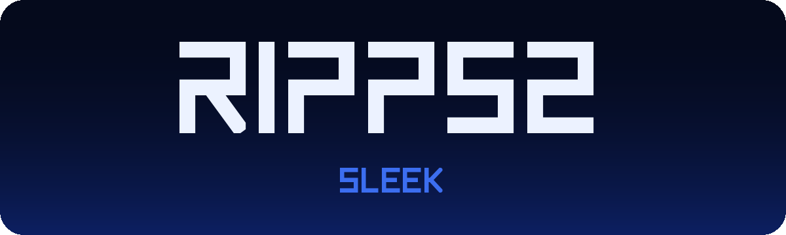
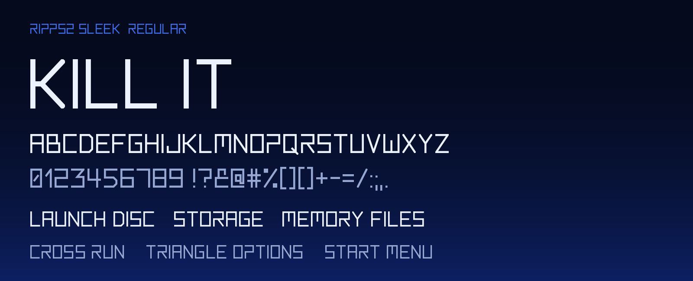
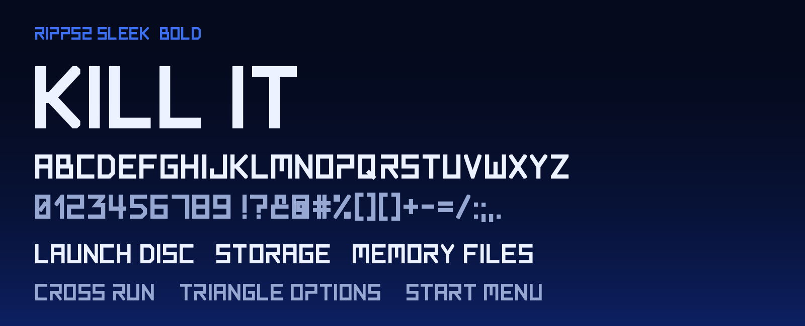
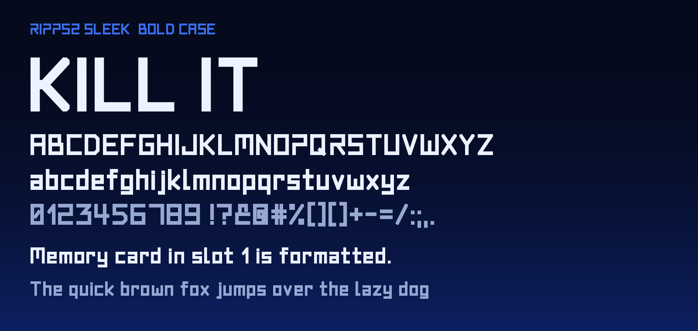

# RIPPS2 Sleek

[](LICENSE-OFL)
[](LICENSE-MIT)
[](https://github.com/akilluminati47/RIPPS2-fonts/releases)
[](https://github.com/akilluminati47/RIPPS2)

The typeface drawn for [RIPPS2](https://github.com/akilluminati47/RIPPS2), the PS2 front end: its menus, button
hints, settings, the view word that names each list, and every theme that wants to look like it belongs.

The letters take the PS2 logo's lettering as their model: one thin, even stroke, square corners, letters built
from horizontal and vertical bars on a grid, and the logo's own open forms (the P with no stem above its bowl,
the zigzag 2). They are narrow, so a full row of button hints fits a 640-pixel screen.

| Cut | Weight | Case | In RIPPS2 |
|---|---|---|---|
| **Regular** | thin stroke | capitals (lowercase draws as capitals) | hints, menus, settings, the source name |
| **Bold** | heavy stroke | capitals | labels beside big glyphs, the view word, the release line |
| **Bold Case** | heavy stroke | a true lowercase | typed text, the on-screen keyboard, descriptions |

## Preview

### Regular



### Bold



### Bold Case



## Character set

Basic Latin, Latin-1 and Latin Extended-A/B: 337 code points in every cut. Accented letters draw as their
base letter for now. The full list: [docs/charset.md](docs/charset.md).

## Download

From [Releases](https://github.com/akilluminati47/RIPPS2-fonts/releases), or straight from this repo:

| Format | Files |
|---|---|
| TTF | [fonts/ttf](fonts/ttf): `RIPPS2Sleek-Regular.ttf`, `RIPPS2Sleek-Bold.ttf`, `RIPPS2Sleek-BoldCase.ttf` |
| WOFF2 (web) | [fonts/woff2](fonts/woff2): the same three |

## Use

**In a RIPPS2 theme** the fonts are already inside `RIPPS2.elf`; name them and ship nothing:

```
default_font=builtin:ripps2sleek       # Regular
font3=builtin:ripps2sleekbold          # Bold
font1=builtin:ripps2sleekcase          # Bold Case
```

[RIPgrid](https://github.com/akilluminati47/RIPPS2-themes) is set entirely in them. Any other OPL-family
theme can use the TTFs from its own folder like any font.

**On the web:**

```css
@font-face { font-family: "RIPPS2 Sleek"; font-weight: 400; src: url("RIPPS2Sleek-Regular.woff2") format("woff2"); }
@font-face { font-family: "RIPPS2 Sleek"; font-weight: 700; src: url("RIPPS2Sleek-Bold.woff2") format("woff2"); }
@font-face { font-family: "RIPPS2 Sleek Case"; font-weight: 700; src: url("RIPPS2Sleek-BoldCase.woff2") format("woff2"); }
```

**On a PC:** install the TTFs as usual. Regular and Bold are one family, *RIPPS2 Sleek*; Bold Case is its own
family, *RIPPS2 Sleek Case* (Bold), so the two never collide.

## Build

Every glyph is a set of polylines on a grid six units tall (the cap height); each one is stroked and the
strokes unioned into a single clean outline. The drawing lives in [tools/make_sleek_font.py](tools/make_sleek_font.py)
(the same file RIPPS2 builds its copies from); [tools/build.py](tools/build.py) makes everything here from it,
and gives the fonts the names and weights desktop apps and browsers read (RIPPS2 itself reads only the outlines).

```
pip install -r requirements.txt
python tools/build.py
```

## Licence

- The fonts: [SIL Open Font License 1.1](LICENSE-OFL). Use them, bundle them, change them; a changed font
  takes a new name.
- The tools: [MIT](LICENSE-MIT).

Not here: Planet N Compact, RIPPS2's main text face, is [Iconian Fonts'](https://www.iconian.com) and stays
theirs; RIPPS2 One, a one-glyph patch for its 1, belongs with it.
